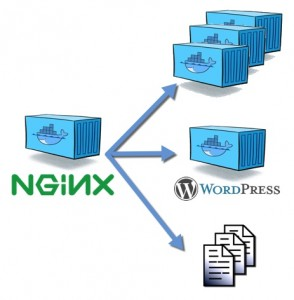

#### Containers Basics 


---

### WHAT IS A CONTAINER?

  - A stand-alone executable package that contains:
     - Code
     - Runtime
     - System tools
     - Libraries
     - Settings
  - Isolates software from its surroundings

---

### HOW DO THEY DIFFER FROM A VM?

+++

An **image** is a lightweight, stand-alone, executable package that includes everything needed to run a piece of software, including the code, a runtime, libraries, environment variables, and config files.

<span class="fragment">Explore and share images on [Docker Hub](https://hub.docker.com/)</span>   

+++

These are a few of my favorites:

- [GitLab CE](https://hub.docker.com/r/gitlab/gitlab-ce/) - GitLab Community Edition
- [MailDev](https://hub.docker.com/r/djfarrelly/maildev/) - SMTP Server + UI for testing emails
- [ownCloud](https://hub.docker.com/_/owncloud/) - Self-hosted file sync and share server
- [Portainer](http://portainer.io/) - Lightweight UI for Docker management

+++

A **Dockerfile** is a text document that contains all the commands a user could call on the command line to assemble an image.

+++

Example `Dockerfile`:

```
FROM php:5-apache

# Change UID/GID of www-data to match local user
RUN usermod --non-unique --uid 1000 www-data \
  && groupmod --non-unique --gid 1000 www-data
  
# Enable Apache2 modules
RUN a2enmod headers rewrite
```

+++

A **container** is a runtime instance of an image – what the image becomes in memory when actually executed.

It runs completely isolated from the host environment by default, only accessing host files and ports if configured to do so.

+++

A **volume** is a specially-designated directory within one or more containers that are designed to persist data, independent of the container’s life cycle (also known as *data volume*).

---

### Installation

+++

[Download](https://www.docker.com/community-edition#/download) and install docker for your platform.

+++

Installing Docker on Ubuntu 16.04 from the official repository:

```bash
sudo apt-key adv --keyserver hkp://pgp.mit.edu:80 --recv-keys 58118E89F3A912897C070ADBF76221572C52609D
sudo apt-add-repository 'deb https://apt.dockerproject.org/repo ubuntu-xenial main'
sudo apt-get update && sudo apt-get install -y docker-engine
sudo groupadd docker
sudo usermod -aG docker $USER
```

---

### Basic usage of the `docker` CLI

+++

Build 'lewebsimple/apache2' image from `Dockerfile` in current directory:

```bash
docker build . -t lewebsimple/apache2
```

+++

List all locally available images:

```bash
docker image ls
```

+++

Run a container using that image:

```bash
docker run -d --name apache2 -p 8080:80 lewebsimple/apache2
```

- '-d' tells the container to run in the background |
- '--name apache2' sets the container name |
- '-p 8080:80' maps port 8080 on the host to port 80 on the container |

+++

List all containers:

```bash
docker ps -a
```

+++

List all networks:

```bash
docker network ls
```

+++

Remove the container named 'apache2':

```bash
docker rm apache2
```

+++

Remove dangling containers, volumes, networks and images:

```bash
docker system prune
```

+++

Read the Docker [documentation](https://docs.docker.com) for more information.

---

### Managing containers, images, volumes and networks


+++

Creating and configuring containers manually, while entirely possible, can be time-consuming and error-prone when projects get more complex.  

<span class="fragment">Fortunately, there is a solution!</span>

+++


Compose is a tool for defining and running multi-container Docker applications.

+++

Using a `docker-compose.yml` file to configure your application’s services and networks, you create and start all the services with a single command.

+++

Example `docker-compose.yml` file:

```yaml
version: '3'

services:
  apache2:
    build: ./images/apache2
    ports:
      - '80:80'
    volumes:
      - ./data/html:/var/www/html

  mysql:
    image: mysql
    environment:
      - MYSQL_ROOT_PASSWORD=${MYSQL_ROOT_PASSWORD}
    ports:
      - '3306:3306'
    volumes:
      - ./data/mysql:/var/www/html
```

+++

Create and start all services:

```bash
docker-compose up -d
```

- '-d' tells the containers to run in the background |

+++

Environment variables should be used for sensitive or specific configurations (i.e. passwords, TLD, etc.)

They can be stored in the `.env` file (which should be excluded from Git).    

+++

Read the Compose [documentation](https://docs.docker.com/compose/) for more information.

---

### Docker + WordPress


+++

The approach I have developed over time involves sharing one database and one web server container for multiple WordPress sites by using a proxy.

+++



+++

The proxy listens for containers having the VIRTUAL_HOST environment variable defined and automatically configures routing.

This is possible thanks to the wonderful [`jwilder/nginx-proxy`](https://github.com/jwilder/nginx-proxy) image!

+++

Since wildcards are supported for VIRTUAL_HOST, the trick is to create a sub-domain and redirect its traffic to a single container.

> *.example.com => Apache2 container

+++

DNS masquerading can be configured on the host to achieve this (you can even use a fake TLD like `.dev`)

Instructions for Ubuntu 16.04:

```bash
sudo apt-get install -y dnsmasq
echo "conf-dir=/etc/dnsmasq.d/,*.conf" | sudo tee -a /etc/dnsmasq.conf
echo "address=/dev/127.0.1.100" > /etc/dnsmasq.d/dev.conf
```

- For Windows, check out Acrylic DNS Proxy |
- For OSX, dnsmasq can be installed using Homebrew |

+++

You could also configure a wildcard CNAME entry in your DNS zone, pointing it to a dynamic DNS domain or static IP (if you have one). 

This will require port forwarding to be configured properly on your router / firewall.

+++

Did I mention you can have automatic SSL certificate generation using [Let's encrypt](https://letsencrypt.org/)?

Check out [`jrcs/letsencrypt-nginx-proxy-companion`](https://github.com/jrcs/letsencrypt-nginx-proxy-companion) for more details!

+++

<video preload="auto" autoplay="autoplay" loop="loop">
   <source src="http://i.imgur.com/iZcUNxH.webm" type="video/webm">
</video>

+++

Many tasks like creating a local WordPress site or importing one from production can be automated using scripts and the WP-CLI.

I might include some in the project in the future.

+++

There are some gotchas to setting this up (like resolving the database host from within the Apache2 container), so feel free to contact me or create an [issue](https://github.com/lewebsimple/docker-wordpress/issues).

---

### Any questions?
